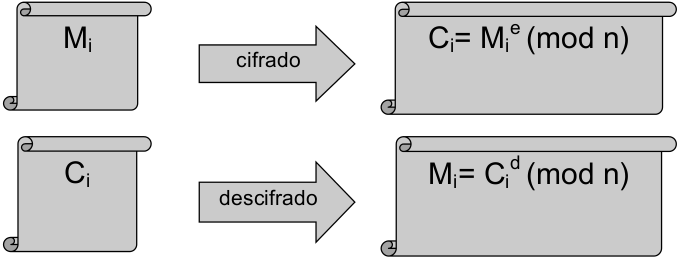

**Autor: Aarón Socas Gaspar**

# CIFRADO RSA

##Objetivo

Implementar el cifrado de clave pública RSA.

##Desarrollo

1. Implementa el cifrado RSA según el diagrama que se incluye a continuación



siendo

Información privada: p, primo, q, primo, φ(n)=(p-1)(q-1), d, entero primo con φ(n)
Información pública: n=p•q, e, inverso de d módulo φ(n)

2. El programa debe solicitar el texto del mensaje a cifrar, los parámetros p, q y d, comprobar que p y q son primos (con el test de Lehman-Peralta) y que d es es primo con φ (n) (con el algoritmo de Euclides).

3. El programa debe mostrar la traza completa del algoritmo, es decir, el parámetro e obtenido con el algoritmo de Euclides, y los números correspondientes al mensaje cifrado, obtenidos utilizando el algoritmo de exponenciación rápida.

Nota: Para la codificación numérica del texto consideraremos alfabeto A-­Z:0-­25 base=26, y dividiremos en bloques de tamaño j­‐1 según el valor de n, de forma que 26^(j-­1)<n<26^j.
Así, por ejemplo, si j-1 = 4, ABCD equivale a 0*26^3+1*26^2+2*26+3=731.


##Ejecución

Antes de nada debemos compilar:
`
    g++ main.cpp rsa.cpp -o rsa (o salida que deseen)
`

Para ejecutar en Linux:
```
    ./rsa (o nombre de salida escogido)
    Introduzca ./rsa nombre_fichero
    Se adjunto fichero de prueba input01
    
```

##Ejemplos

Texto a cifrar: MANDA DINEROS, y los parámetros p=421, q=7 y d=1619:
    - comprueba que p y q son primos, que d es primo con φ (n)=2520 y calcula el parámetro e=179,
    + como n = 2947, divide el texto en bloques de 2 caracteres, pasa cada bloque a decimal para operar, obteniendo 312, 341, 3, 221, 121, 382, y calcula los números correspondientes al cifrado: 2704, 2173, 404, 2340, 1789, 2333

Texto a cifrar: AMIGO MIO, y los parámetros p=2347, q=347 y d=5:
    - comprueba que p y q son primos, que d es primo con φ (n)= 811716 y calcula el parámetro e= 649373,
    + como n=814.409, divide el texto en bloques de 4 caracteres, pasa el bloque a decimal, obteniendo 8326, 254398, y calcula los números correspondientes al cifrado: 587813, 526359

    
--------------------------------------------------------------------------
*Aarón Socas Gaspar- Seguridad de Sistemas Informáticos (Curso 2013-2014)*